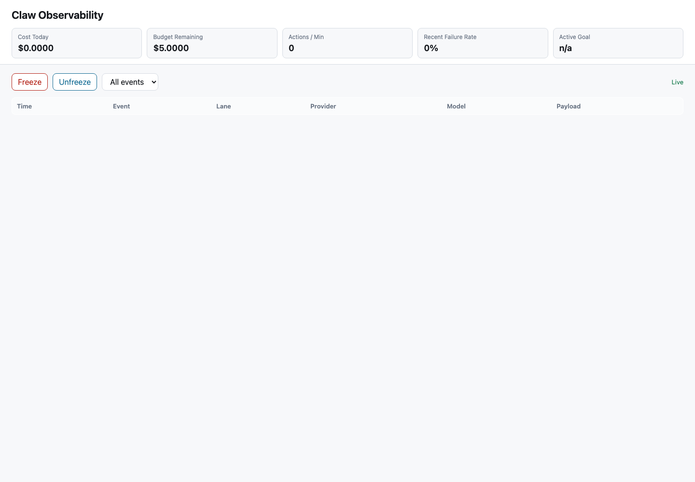

# PR #1.5 — Ventana de observación reforzada

## Summary

Implements the reinforced observation window needed before PR #2a:

- Manual kill switches: `/freeze`, `/unfreeze`, `/budget_status`
- Automatic circuit breakers: rolling cost/hour and tool calls/minute
- Hard denylist for high-risk tool commands
- Standalone dashboard at `/observability`
- Telegram observability stream for Tier-2+ tool events and degraded LLM events
- Window-mode documentation for reduced budget, max autoexec tier, maintenance disablement, and credential parking

## Validation

```bash
.venv/bin/pytest tests/test_observation_window.py -q
.venv/bin/pytest tests/test_tools.py -q
.venv/bin/pytest tests/test_llm.py -q
.venv/bin/pytest tests/test_web_transport.py -q
.venv/bin/pytest tests/test_bot.py::BotTests::test_freeze_command_blocks_tool_dispatch_until_unfreeze -q
```

## Dashboard



Note: screenshot captured on an ephemeral local port because `127.0.0.1:8765` was already held by the active local daemon. The implemented production route is `http://127.0.0.1:8765/observability`.

## Controlled-Zone Notes

This PR intentionally touches `llm.py` and the existing audit path to attach observation-window circuit breakers. No P0 storage modules or JSONL schemas were modified.

## Follow-Up

- Configure `CLAW_OBSERVABILITY_TELEGRAM_CHAT_ID` with the dedicated "Claw Observability" chat id in the production environment.
- Activate `CLAW_BUDGET_CAP_DAILY`, `CLAW_TIER_AUTOEXEC_MAX=tier_2`, and `CLAW_AUTONOMOUS_MAINTENANCE=0` for the observation window.
